# Interactive Spatial-Frequency Fusion Mamba for Multi-Modal Image Fusion 

<div align="center">

<!-- 这里把 2402.xxxxx 替换成你真实的 arXiv ID -->
<a href="[https://arxiv.org/abs/2602.04405](https://arxiv.org/abs/2602.04405)">
  
</a>
<!-- 2. 技术栈 -->
<a href="https://www.python.org/"></a>
<a href="https://pytorch.org/"></a>
<a href="https://github.com/state-spaces/mamba"></a>
<!-- MIT License -->
<a href="https://opensource.org/licenses/MIT">
  
</a>

</div>

<div align="center">
  <a href="https://arxiv.org/abs/2602.04405">TIP 2025 Paper</a>
</div>


<div align="center">
  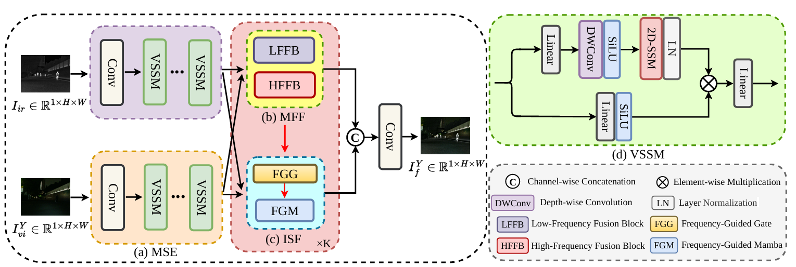
</div>

**ISFM** is a novel Mamba-based interactive spatial-frequency fusion framework designed for Multi-Modal Image Fusion (MMIF). It aims to fully exploit the complementarity of domain-specific characteristics by incorporating frequency information into the spatial fusion process and leveraging Mamba to capture long-range dependencies.
Specifically, we propose a Multi-scale Frequency Fusion to adaptively integrates low-frequency and high-frequency components of different modalities in multiple scales. 
To fully explore the complementarity of domain-specific characteristics, we propose an Interactive Spatial-Frequency Fusion including a Frequency-Guided Mamba and a Frequency-Guided Gate.
By combining these modules, our ISFM comprehensively integrates complementary information in the spatial and frequency domains. Extensive experiments on six MMIF datasets demonstrate that our method can achieve better performance than other state-of-the-art methods.


## News  
Exciting news! Our paper has been accepted by the TIP 2025! 🎉🎉 [Paper](https://arxiv.org/abs/2602.04405)


## Table of Contents
- [Introduction](#introduction)  
- [Contributions](#contributions)
- [Results](#results)
- [Visualizations](#visualizations)
- [Reproduction](#reproduction)
- [Citation](#citation)
  
## Introduction  
ISFM is a Mamba-based interactive spatial-frequency fusion framework for Multi-Modal Image Fusion (MMIF). This repository provides the training and testing code, along with pretrained weights for reproducing the results in our paper.

## Contributions  
- We introduce a novel Interactive Spatial-Frequency Fusion Mamba (ISFM) framework for MMIF. It provides a distinct perspective for spatial-frequency fusion.
- We propose a Multi-scale Frequency Fusion (MFF) to effectively fuse frequency information across multiple scales. In addition, we propose an Interactive Spatial Frequency Fusion (ISF) to fully exploit the complementarity of spatial-frequency information.
- Extensive experiments on IVIF and MIF tasks validate the effectiveness of our method. We also validate our method in helping high-level computer vision tasks.

## Results  
### Quantitative Comparison
<div align="center">
  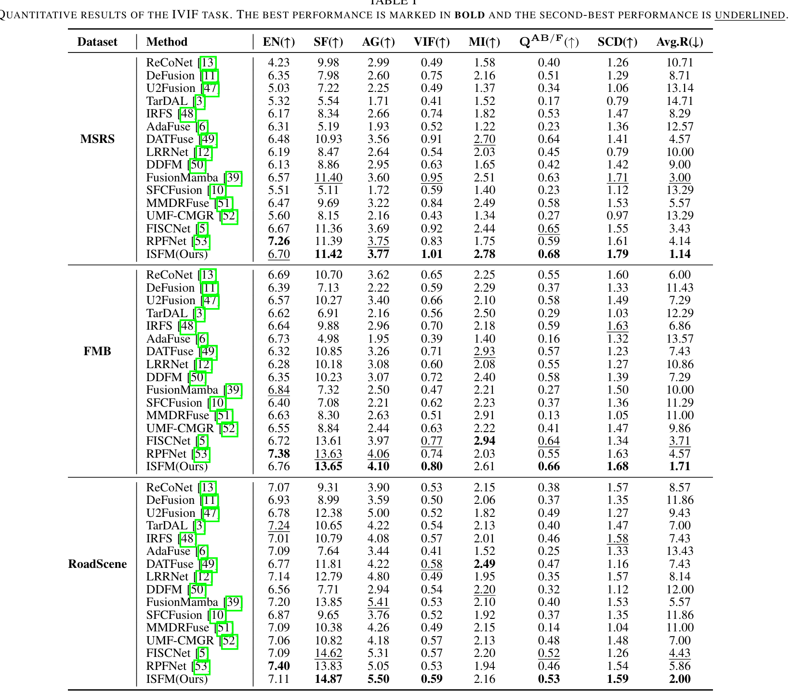
</div>
<div align="center">
  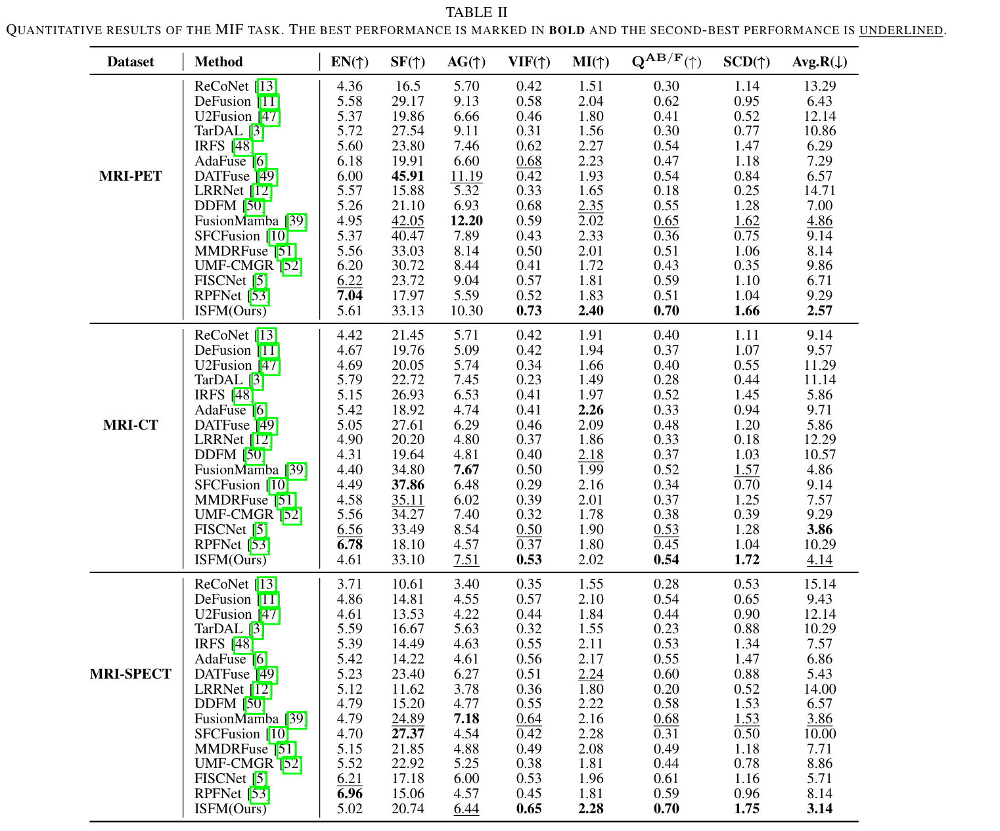
</div>

### Evaluation of Downstream Tasks
<div align="center">
  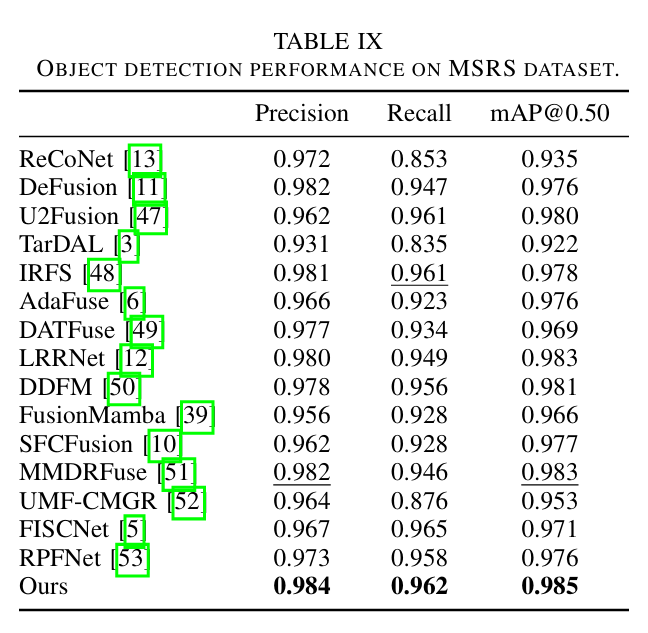
</div>
<div align="center">
  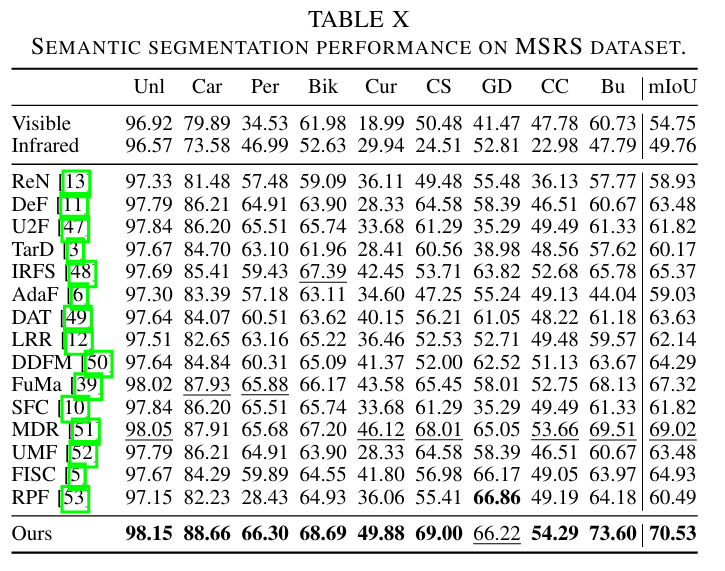
</div>

## Visualizations  
### Qualitative Comparison
Comparison with state-of-the-art methods on MMIF datasets.
<div align="center">
  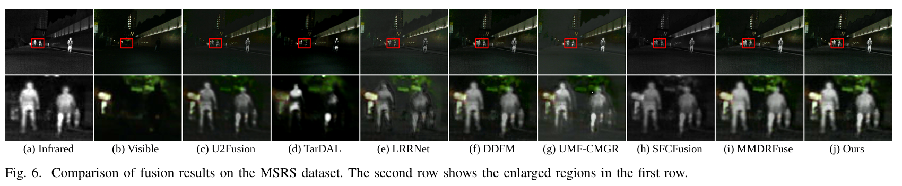
</div>
<div align="center">
  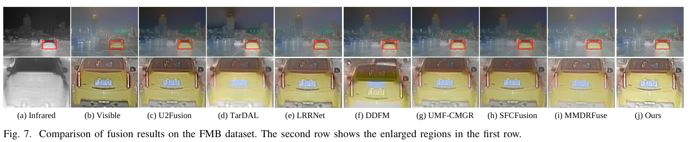
</div>
<div align="center">
  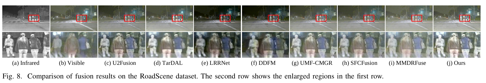
</div>
<div align="center">
  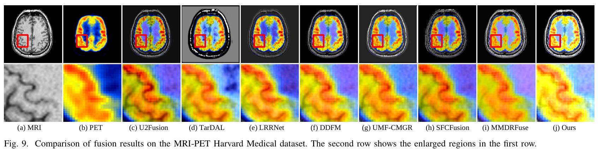
</div>
<div align="center">
  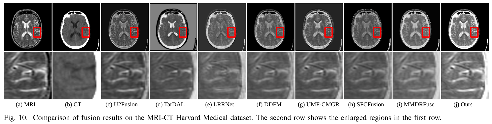
</div>
<div align="center">
  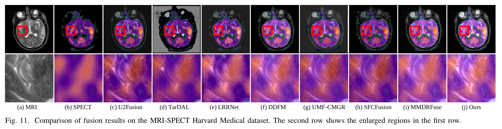
</div>

### Feature Map Visualization
To validate the effectiveness of the proposed modules, we visualize the extracted features of different modules.

<div align="center">
  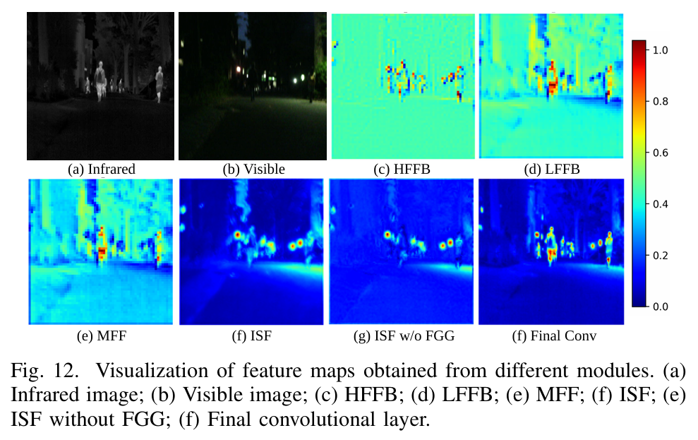
</div>

### Frequency Domain Decomposition
To visually validate the effectiveness of our frequency domain fusion mechanism,we conduct two kinds of visualization experiments. First,we show the DWT decomposition of the source images and the corresponding features fused by the proposed MFF.
<div align="center">
  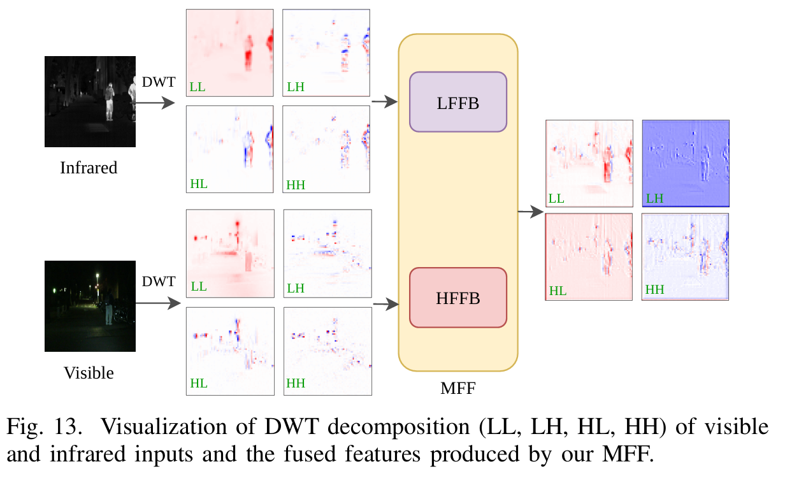
</div>
Second, we visualize the effect of the high-frequency enhancement operation.
<div align="center">
  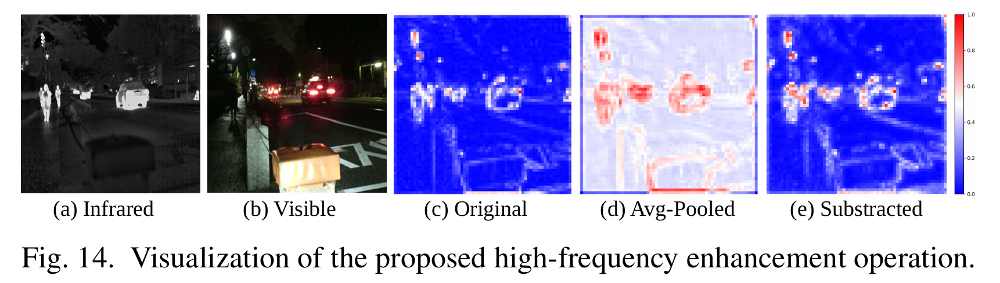
</div>

### Evaluation of Downstream Tasks
We further evaluate the effectiveness of our method in two downstream tasks, i.e., object detection and semantic segmentation.
<div align="center">
  
</div>
<div align="center">
  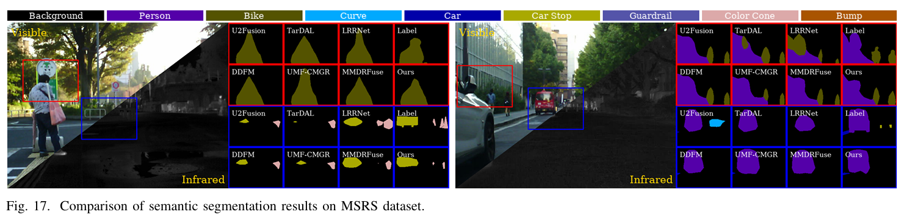
</div>

## Reproduction  
### Requirements 
- Python 3.8
- PyTorch 2.0.1
- CUDA 11.7
- mamba-ssm 1.2.0

### Installation 

```bash

# Create a virtual environment
conda create -n ISFM python=3.8 -y
conda activate ISFM

# Install dependencies
pip install -r requirements.txt

```

### Datasets

We use the following datasets. Please organize the files following the directory structure.

| Datasets | Download link |
|:--------|:-----------|
| **MSRS** | [Download here](https://github.com/Linfeng-Tang/MSRS) | 
| **RoadScene** | [Download here](https://github.com/hanna-xu/RoadScene) | 
| **FMB** | [Download here](https://github.com/JinyuanLiu-CV/SegMiF) | 
| **Harvard** | [Download here](https://www.med.harvard.edu/AANLIB/home.html) | 


Directory structure is as followed, note that open your config file and modify `INPUT.ROOT_DIR` to point to your downloaded dataset directory:  
```bash
data/
├── train/
│ ├── vi/ # Visible image
│ └── ir/ # Infrared image
└── test/
├── vi/
└── ir/
```

### Usage 
The configuration is defined in the `.yaml` files (e.g., `configs/train.yaml`). Before running the code, please modify the paths to match your local environment.
1)To train the ISFM model from scratch, run:

```bash
python train.py --config configs/train.yaml
```
The training logs and model checkpoints will be automatically saved in output/exp_name/.

2)To evaluate a specific model, modify TEST.CHECKPOINT_PATH to point to your pretrained weight, then run:
```bash
python test.py --config configs/test.yaml
```
**Note**: You can also override the config options directly from the command line without modifying the yaml file:
```bash
python test.py --config configs/test.yaml TEST.CHECKPOINT_PATH "checkpoints/best.pth"
```

## Citation  
If you find ISFM useful in your research, please consider citing:
```bibtex
@article{zhu2026isfm,
      title={Interactive Spatial-Frequency Fusion Mamba for Multi-Modal Image Fusion}, 
      author={Zhu, Yixin and Lv, Long and Zhang, Pingping and Liu, Xuehu and Tang, Tongdan and Tian, Feng and Sun, Weibing and Lu, Huchuan},
      journal={arXiv preprint arXiv:2602.04405},
      year={2026},
}

